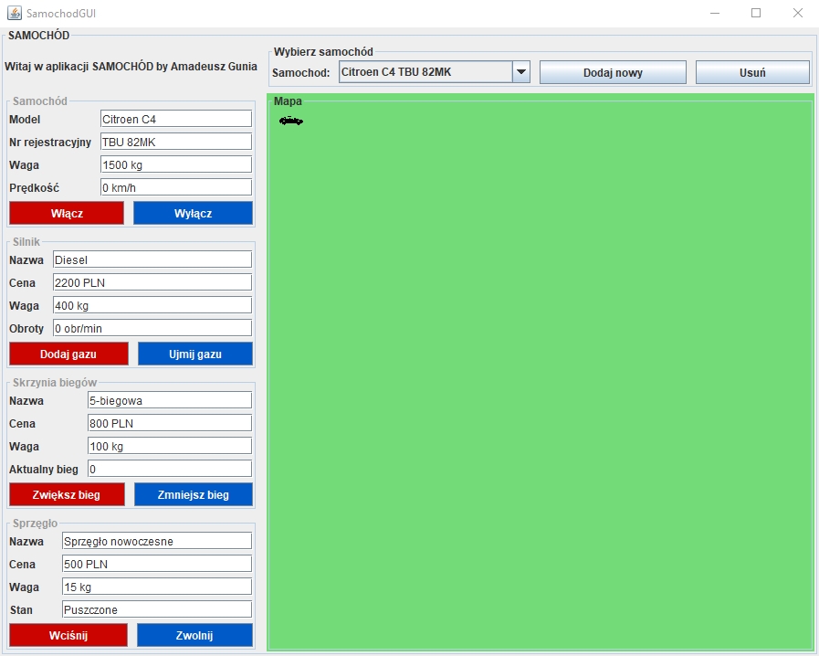
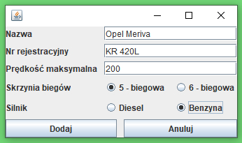

# Symulator samochodu
Moja pierwsza aplikacja zawierająca GUI. Prosty symulator samochodu napisany w języku Java. 
Aplikacja tworzona w trakcie laboratorium z przedmiotu Programowanie Obiektowe w 3. semestrze studiów na kierunku Teleinformatyka (AGH Kraków).

## Przegląd aplikacji
Aplikacja umożliwia sterowanie samochodem poruszającym się po dwuwymiarowej przestrzeni. Każdy samochód to osobny wątek więc możliwe jest dodanie kilku samochodów i sterowanie nimi jednocześnie. Domyślnie aplikacja uruchamia się z jednym samochodem.

#### Okno główne - sterowanie samochodem

W oknie głównym aplikacji znajdują się pola i przyciski do sterowania samochodem oraz plansza, po której samochód się porusza. 
Aby ustalić cel podróży należy kliknąć na dowolny punkt planszy. Aby samochód ruszył z miejsca należy zapewnić by jego prędkość była większa od 0 tj. włączyć samochód oraz ustawić bieg co najmniej na 1.

#### Dodawanie nowego samochodu

Aplikacja umożliwia obsługę kilku samochodów jednocześnie. Aby dodać nowy samochód należy kliknąć przycisk w głównym oknie i wypełnić formularz. 

#### Animacja ruchu samochodów

Powyższa animacja pokazuje poruszające się samochody. Każdy samochód jest sterowany niezależnie od innych tj. ma inne parametry (m. in. prędkość oraz punkt docelowy), które możemy zmieniać w dowolnej chwili. 

## Uruchomienie aplikacji
* Pobierz zawartość repozytorium
* Zaimportuj projekt do IntelliJ lub innego środowiska obsługującego język Java
* W klasie SamochodGUI.java uruchom metodę main